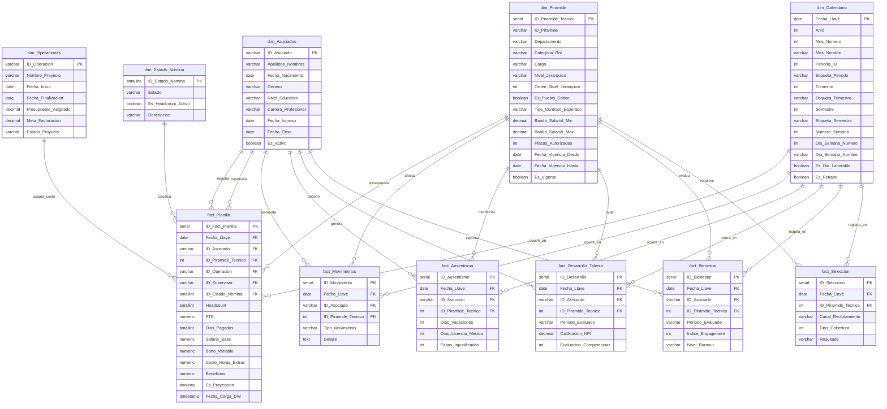

# 📊 Modelo Transaccional de Core HR, Compensaciones y Bienestar Psicosocial

**Firma de Consultoría:** Gemito Consultancy     

**Área de Aplicación:** People Analytics & Strategic Workforce Planning

**Fase del Proyecto:** Arquitectura Dimensional V2.2 — Dimensiones + fact_Planilla Auditadas y Aprobadas

---

## 🎯 1. Visión General del Proyecto

Este proyecto despliega una arquitectura de datos transaccional optimizada para una firma consultora matricial de 500 plazas. El objetivo es unificar métricas financieras, operativas y psicosociales bajo un **Modelo en Estrella (Star Schema)** en PostgreSQL, visualizado en Power BI.

**Stack tecnológico:** PostgreSQL · Power BI · Metodología Kimball · SCD Tipo 2 aplicado en dim_Piramide

---

## 🗺️ 2. Diagrama Entidad-Relación (ERD) — V2.2



---

## 🗂️ 3. Diccionario de Dimensiones V2.2

### dim_Asociados — El "Quién"
Dimensión maestra de colaboradores. Trazabilidad completa del ciclo de vida.

| Campo | Tipo | Descripción |
|---|---|---|
| ID_Asociado | VARCHAR(10) PK | Código único. Formato: GC001. Dummy Record: GC000 = Sin Supervisor |
| Apellidos_Nombres | VARCHAR(256) | Orden alfabético nativo para Power BI |
| Fecha_Nacimiento | DATE | Para cálculo de edad y segmentación generacional |
| Genero | VARCHAR(15) | CHECK: Masculino / Femenino |
| Nivel_Educativo | VARCHAR(50) | CHECK: Estudiante / Técnico / Bachiller / Titulado / Maestría |
| Carrera_Profesional | VARCHAR(100) | Ej: Psicología, Ingeniería de Sistemas |
| Fecha_Ingreso | DATE | Día de registro. Base para cálculo de tenure |
| Fecha_Cese | DATE NULL | NULL = colaborador activo. MVP: cero reingresos |
| Es_Activo | BOOLEAN GENERATED | Columna generada STORED: TRUE si Fecha_Cese IS NULL |

> **Nota de diseño:** `Es_Activo` es columna generada (STORED). No requiere actualización manual. Usar como filtro base en todas las medidas DAX de headcount.

> **Dummy Record GC000:** Registro especial `GC000 — Sin Supervisor` insertado en `dim_Asociados` para absorber a los colaboradores en la cúspide de la pirámide organizacional (Gerente General) que no tienen supervisor dentro de la firma. Patrón consistente con `O000` en `dim_Operaciones`. Evita NULLs en `fact_Planilla` y mantiene la integridad referencial.

> **Restricción MVP:** `dim_Asociados` no implementa SCD Tipo 2. Los atributos del colaborador se asumen estáticos durante el período de análisis. Si un colaborador cambia de nivel educativo o carrera profesional, el registro se actualiza (SCD Tipo 1) y el histórico previo refleja el valor actual. Deuda técnica documentada para versiones futuras.

---

### dim_Calendario — El "Cuándo"
Eje temporal optimizado para Power BI. Granularidad diaria. Rango: 5 años.

| Campo | Tipo | Descripción |
|---|---|---|
| Fecha_Llave | DATE PK | Clave primaria en formato fecha |
| Anio / Mes_Numero / Mes_Nombre | INT / INT / VARCHAR | Descomposición temporal estándar |
| Periodo_ID | INT | ID matemático para ordenar ejes. Ej: 202603 |
| Etiqueta_Periodo | VARCHAR(7) | Eje visual. Ej: Mar2026. Ordenar por Periodo_ID en Power BI |
| Trimestre / Etiqueta_Trimestre | INT / VARCHAR | Ej: Q1-2026 |
| Semestre / Etiqueta_Semestre | INT / VARCHAR | Ej: H1-2026 |
| Numero_Semana | INT | ISO 8601 (1-53). Requerido para análisis semanal de ausentismo |
| Dia_Semana_Numero / Nombre | INT / VARCHAR | ISO: 1=Lunes, 7=Domingo |
| Es_Dia_Laborable | BOOLEAN | Para cálculo de ausentismo real y FTE |
| Es_Feriado | BOOLEAN DEFAULT FALSE | Requerido para horas extras y ausentismo justificado |

---

### dim_Piramide — El "Dónde y Cuánto" · SCD Tipo 2 Activo
Estructura organizacional de 500 plazas con bandas salariales Broadbanding.

| Campo | Tipo | Descripción |
|---|---|---|
| ID_Piramide_Tecnico | SERIAL PK | **Surrogate key. Única FK válida en todas las tablas de hechos** |
| ID_Piramide | VARCHAR(5) UNIQUE | Smart Key de negocio. Solo referencia humana. Ej: RRA02 |
| Departamento | VARCHAR(100) | 7 departamentos: Gerencia Gral, Operaciones, Comercial, Finanzas, RRHH & Legal, Tecnología, Administración |
| Categoria_Rol | VARCHAR(30) | CHECK: Core/Producción / Back-Office / Terceros |
| Cargo | VARCHAR(100) | Título oficial del puesto |
| Nivel_Jerarquico | VARCHAR(30) | CHECK: Practicante / Operativo / Analista / Coordinador / Jefe / Gerente |
| Orden_Nivel_Jerarquico | INT | 0 al 5. Ancla de ordenamiento visual en Power BI |
| Es_Puesto_Critico | BOOLEAN | TRUE = vacancia mayor a 30 días impacta facturación o cumplimiento regulatorio |
| Tipo_Contrato_Esperado | VARCHAR(50) | CHECK: sin Convenio Formativo en Jefe/Gerente |
| Banda_Salarial_Min / Max | NUMERIC(10,2) | CHECK: Min <= Max. Modelo Broadbanding activo |
| Plazas_Autorizadas | INT | Headcount presupuestado por fila. Usar "No resumir" en Power BI |
| Fecha_Vigencia_Desde | DATE | Inicio de vigencia del registro SCD Tipo 2 |
| Fecha_Vigencia_Hasta | DATE DEFAULT '2099-12-31' | Registro activo = fecha sentinel Kimball |
| Es_Vigente | BOOLEAN DEFAULT TRUE | Filtro maestro para estructura organizacional actual |

> **SCD Tipo 2 — Por qué existe:** Cuando un colaborador es promovido, su nuevo puesto tiene una banda salarial distinta. Si el registro del puesto se sobreescribiera (SCD Tipo 1), los hechos históricos en `fact_Planilla` mostrarían la banda actual en lugar de la banda vigente en el momento de la transacción, distorsionando el compa-ratio histórico. Con SCD Tipo 2 cada registro de `fact_Planilla` queda congelado contra la versión exacta del puesto vigente en ese mes.

> **Regla crítica:** Todas las FKs hacia `dim_Piramide` deben referenciar `ID_Piramide_Tecnico` (surrogate key INT), nunca `ID_Piramide` (smart key VARCHAR). De lo contrario el SCD Tipo 2 no funciona.

> ⚠️ **Procedimiento SCD Tipo 2 — ejecutar siempre como transacción:**
> ```sql
> BEGIN;
>   UPDATE dim_Piramide
>   SET Fecha_Vigencia_Hasta = <fecha_cambio - 1 dia>,
>       Es_Vigente = FALSE
>   WHERE ID_Piramide = '<smart_key>' AND Es_Vigente = TRUE;
>
>   INSERT INTO dim_Piramide (..., Fecha_Vigencia_Desde, Fecha_Vigencia_Hasta, Es_Vigente)
>   VALUES (..., <fecha_cambio>, '2099-12-31', TRUE);
> COMMIT;
> ```

---

### dim_Operaciones — Proyectos y Rentabilidad
Eje de proyectos con Dummy Record Kimball para personal de soporte.

| Campo | Tipo | Descripción |
|---|---|---|
| ID_Operacion | VARCHAR(10) PK | Código correlativo. Ej: O001 |
| Nombre_Proyecto | VARCHAR(100) | Nombre del cliente o servicio |
| Fecha_Inicio / Fecha_Finalizacion | DATE | CHECK: Finalizacion >= Inicio. Finalizacion nullable para proyectos sin cierre definido |
| Presupuesto_Asignado | NUMERIC(12,2) | Costo operativo proyectado |
| Meta_Facturacion | NUMERIC(12,2) | Ingresos proyectados. Calcular márgenes con SUMX en DAX |
| Estado_Proyecto | VARCHAR(20) | CHECK: Activo / Cerrado / Suspendido |

> **Dummy Record Kimball:** `O000 — Back-Office / Overhead Corporativo` (Presupuesto/Meta = 0.00). Absorbe los colaboradores de soporte en los hechos para evitar NULLs en el cálculo de margen corporativo.

---

### dim_Estado_Nomina — Estado Laboral Mensual
Dimensión maestra de estados de nómina. Dominio cerrado y estático. 5 registros fijos.

| Campo | Tipo | Descripción |
|---|---|---|
| ID_Estado_Nomina | SMALLINT PK | Valores del 1 al 5 |
| Estado | VARCHAR(50) | CHECK: Activo Regular / Licencia Con Goce / Licencia Sin Goce / Cesado / Suspendido |
| Es_Headcount_Activo | BOOLEAN | Fuente de verdad única para el KPI de headcount. TRUE solo para Activo Regular y Licencia Con Goce |
| Descripcion | VARCHAR(200) | Definición operacional de cada estado |

| ID | Estado | Es_Headcount_Activo |
|---|---|---|
| 1 | Activo Regular | TRUE |
| 2 | Licencia Con Goce | TRUE |
| 3 | Licencia Sin Goce | FALSE |
| 4 | Cesado | FALSE |
| 5 | Suspendido | FALSE |

> **Fuente de verdad de headcount:** El KPI de headcount activo debe calcularse siempre desde esta dimensión, nunca desde un campo en la tabla de hechos. Medida DAX base: `Headcount Activo = CALCULATE(SUM(fact_Planilla[Headcount]), dim_Estado_Nomina[Es_Headcount_Activo] = TRUE)`

---

## 📋 4. Diccionario de fact_Planilla

Granularidad: Periodic Snapshot — una fila por empleado por mes.

### Llaves y Dimensiones

| Campo | Tipo | FK | Descripción |
|---|---|---|---|
| ID_Fact_Planilla | SERIAL PK | — | Llave surrogate de la fact |
| Fecha_Llave | DATE | dim_Calendario | Eje temporal. Primer día hábil del mes |
| ID_Asociado | VARCHAR(10) | dim_Asociados | Empleado registrado en el mes |
| ID_Piramide_Tecnico | INT | dim_Piramide | Surrogate key SCD Tipo 2. Congela la banda salarial exacta del mes |
| ID_Operacion | VARCHAR(10) | dim_Operaciones | NOT NULL. O000 para Back-Office |
| ID_Supervisor | VARCHAR(10) | dim_Asociados | Role-playing dimension. GC000 para cúspide de pirámide |
| ID_Estado_Nomina | SMALLINT | dim_Estado_Nomina | Estado laboral del empleado en ese mes |

> **ID_Supervisor — Relación inactiva en Power BI:** `dim_Asociados` aparece dos veces en el modelo estrella: una como empleado (relación activa) y otra como supervisor (relación inactiva). Para activar la relación del supervisor en una medida DAX usar `USERELATIONSHIP(fact_Planilla[ID_Supervisor], dim_Asociados[ID_Asociado])`. Ejemplo de medida de Span of Control: `Reportes Directos = CALCULATE(DISTINCTCOUNT(fact_Planilla[ID_Asociado]), USERELATIONSHIP(fact_Planilla[ID_Supervisor], dim_Asociados[ID_Asociado]))`

> **Validación DAX de coherencia jerárquica:** Medida de auditoría para detectar anomalías en la asignación de supervisores. Identifica empleados cuyo supervisor tiene un nivel jerárquico menor o igual al propio, lo cual indica un error de carga en el ETL: `Anomalias Supervision = CALCULATE(DISTINCTCOUNT(fact_Planilla[ID_Asociado]), FILTER(fact_Planilla, RELATED(dim_Piramide[Orden_Nivel_Jerarquico]) >= CALCULATE(MAX(dim_Piramide[Orden_Nivel_Jerarquico]), USERELATIONSHIP(fact_Planilla[ID_Supervisor], dim_Asociados[ID_Asociado]))))`

### Factores de Conteo

| Campo | Tipo | Descripción |
|---|---|---|
| Headcount | SMALLINT | Fijo en 1. CHECK (Headcount = 1). Base para conteo absoluto |
| FTE | NUMERIC(5,4) | CHECK >= 0 y <= 1.0000. Factor de estandarización por tiempo completo. Practicantes y parciales tienen FTE < 1 |
| Dias_Pagados | SMALLINT | CHECK entre 0 y 31. Evita falsos positivos en compa-ratio para meses incompletos |

### Medidas Monetarias (Soles S/)

| Campo | Tipo | Descripción |
|---|---|---|
| Salario_Base | NUMERIC(10,2) | CHECK >= 0. Permite cero en Licencia Sin Goce mes completo |
| Bono_Variable | NUMERIC(10,2) | DEFAULT 0.00. Target Cash Variable |
| Costo_Horas_Extras | NUMERIC(10,2) | DEFAULT 0.00. Sobrecostos de nómina |
| Beneficios | NUMERIC(10,2) | DEFAULT 0.00. Agrupa cargas sociales, EPS y provisiones |

> **Costo Total del Empleador (CTC):** No existe como columna almacenada. Es una medida DAX calculada: `CTC = [Salario Base] + [Bono Variable] + [Costo Horas Extras] + [Beneficios]`. Esta decisión evita el riesgo de constraint roto y mantiene el cálculo flexible ante cambios en los componentes.

> **Beneficios — Deuda técnica documentada:** El campo `Beneficios` agrupa cargas sociales, EPS y provisiones en un único valor para simplificar el MVP. En un modelo productivo estos tres conceptos se separarían en columnas independientes dado que tienen lógicas de cálculo y base legal distintas. Decisión de alcance, no de error de diseño.

### Auditoría

| Campo | Tipo | Descripción |
|---|---|---|
| Es_Proyeccion | BOOLEAN | DEFAULT FALSE. TRUE si el registro fue generado después del corte del día 20 |
| Fecha_Carga_DW | TIMESTAMP | DEFAULT CURRENT_TIMESTAMP. Trazabilidad ETL |

> **Regla del corte del día 20:** El ETL genera los registros mensuales con datos reales hasta el día 20 de cada mes. Los días restantes se calculan como proyección lineal. Los registros con `Es_Proyeccion = TRUE` son estimaciones. Las medidas de masa salarial confirmada deben filtrar `Es_Proyeccion = FALSE`. Las medidas de proyección presupuestal pueden incluir ambos valores.

### KPIs soportados por fact_Planilla

| KPI | Lógica DAX base |
|---|---|
| Masa Salarial Total | `SUM(fact_Planilla[Salario_Base])` |
| Headcount Activo | `CALCULATE(SUM(fact_Planilla[Headcount]), dim_Estado_Nomina[Es_Headcount_Activo] = TRUE)` |
| Compa-ratio | `DIVIDE([Salario Base Promedio], AVERAGE(dim_Piramide[Banda_Salarial_Max]))` |
| CTC Total | `[Salario Base] + [Bono Variable] + [Costo Horas Extras] + [Beneficios]` |
| FTE Normalizado | `SUMX(fact_Planilla, fact_Planilla[Salario_Base] * fact_Planilla[FTE])` |
| Variacion MoM | Comparacion de masa salarial entre periodos via dim_Calendario |
| Empleados fuera de banda | Comparacion de Salario_Base contra Banda_Salarial_Min/Max de dim_Piramide |
| Span of Control | `CALCULATE(DISTINCTCOUNT(fact_Planilla[ID_Asociado]), USERELATIONSHIP(...))` |

---

## 📋 5. Tablas de Hechos — Estado por Fase

| Tabla | Granularidad | Fase | Estado |
|---|---|---|---|
| fact_Planilla | 1 fila por empleado por mes | Fase 1 | ✅ DDL Completado |
| fact_Movimientos | 1 fila por evento de movimiento | Fase 1 | 🔜 En diseño |
| fact_Ausentismo | 1 fila por empleado por mes | Fase 1 | 🔜 En diseño |
| fact_Desarrollo_Talento | 1 fila por evaluacion trimestral | Fase 1 | 🔜 En diseño |
| fact_Bienestar | 1 fila por medicion de bienestar | Fase 2 | ⏸ Pendiente |
| fact_Seleccion | 1 fila por proceso de seleccion | Fase 2 | ⏸ Pendiente |

> **Principio rector:** El modelo se construye de menos a más. La arquitectura dimensional está diseñada para escalar sin rediseño estructural.

> **Regla de medicion trimestral (fact_Desarrollo_Talento y fact_Bienestar):** La medicion se registra el primer mes de cada trimestre y evalua el trimestre anterior. Ejemplo: un registro con Fecha_Llave en abril 2026 evalua el período enero-marzo 2026. El campo `Periodo_Evaluado VARCHAR(7)` (formato Q1-2026) identifica el trimestre evaluado, no el mes de registro. Las medidas DAX deben filtrar por `Periodo_Evaluado`, no por `Fecha_Llave`, para análisis de tendencia correctos.

---

## 🚀 6. Estado del Proyecto

| Fase | Descripción | Estado |
|---|---|---|
| Dimensiones V2.1 | 4 tablas auditadas y aprobadas | ✅ Completado |
| dim_Estado_Nomina | Dimension de estados de nomina | ✅ Completado |
| DDL Dimensiones | Script SQL listo para ejecución | ✅ Completado |
| fact_Planilla | DDL auditado y aprobado | ✅ Completado |
| Indices de performance | fecha · piramide · asociado | ✅ Incluidos en DDL |
| Script dim_Calendario | Generacion masiva 5 años | 🔜 Pendiente |
| fact_Movimientos | DDL en diseño | 🔜 En diseño |
| fact_Ausentismo | DDL en diseño | 🔜 En diseño |
| fact_Desarrollo_Talento | DDL en diseño | 🔜 En diseño |
| Datos sintéticos | 500 empleados ficticios | 🔜 Pendiente |
| Dashboard Power BI | Modelo estrella + DAX | 🔜 Pendiente |

---

## 📁 7. Estructura del Repositorio

```
People_Analytics_GemitoConsultancy/
│
├── Estructura SQL/
│   ├── gemito_ddl_v2_1.sql       <- DDL de las 4 dimensiones core
│   └── gemito_ddl_v2_2.sql       <- DDL de dim_Estado_Nomina + fact_Planilla
│
└── README.md
```

---

*People Analytics · Gemito Consultancy · Mayo 2026*
*Metodología Kimball · Star Schema · PostgreSQL + Power BI*
