# People Analytics Data Warehouse — Gemito Consultancy MVP

> *"Las mejores decisiones sobre personas no vienen de la intuición. Vienen de datos bien ordenados, bien entendidos y bien visualizados."*

---

## ¿Por qué existe este proyecto?

Soy estudiante de Psicología en la **Universidad Nacional Mayor de San Marcos (UNMSM)** con prácticas activas en el área de Compensaciones de TCS Perú. Mi meta profesional es clara: trabajar en **People Analytics**, el campo donde la psicología organizacional y los datos se encuentran para tomar mejores decisiones sobre las personas en las organizaciones.

Este proyecto nace de una convicción simple: **para analizar datos, primero tienes que saber trabajar con ellos**. Ordenarlos. Estructurarlos. Entender de dónde vienen y hacia dónde van. Antes de construir un dashboard o entrenar un modelo predictivo, necesitas una base de datos que tenga sentido.

Este es mi **primer MVP de Data Warehouse**, construido desde cero aplicando la **Metodología Kimball** sobre PostgreSQL. No soy ingeniero de datos — soy un analítico que cree en la propuesta de People Analytics y que está construyendo las bases técnicas para llegar a donde quiere llegar: **diseñar e implementar modelos predictivos de KPIs de RRHH** que ayuden a las organizaciones a anticipar la rotación, optimizar la compensación y desarrollar el talento con evidencia.

---

## El modelo

**Gemito Consultancy** es una empresa de consultoría ficticia de 500 colaboradores. Su Data Warehouse de RRHH cubre 5 años de operaciones (2022–2026) y está diseñado para responder las preguntas que los gerentes hacen pero que los sistemas de RRHH tradicionales no tienen listas:

- ¿Cuánto le cuesta realmente un colaborador a la empresa?
- ¿Quiénes están por debajo de su banda salarial y cuánto?
- ¿Qué departamento tiene mayor ausentismo recurrente?
- ¿El performance mejora después de una promoción?
- ¿Qué perfiles tienen mayor riesgo de rotar?

---

## Métricas del modelo

| | | | |
|:---:|:---:|:---:|:---:|
| **10** | **500** | **~53,000** | **5 años** |
| Tablas Star Schema | Colaboradores | Filas estimadas | Cobertura temporal |
| 6 dims · 4 facts | Plazas autorizadas | Entre las 4 facts | 2022 → 2026 |

---

## Diagrama Entidad-Relación

```mermaid
erDiagram
    dim_Asociados {
        varchar ID_Asociado PK
        varchar Apellidos_Nombres
        date Fecha_Nacimiento
        varchar Genero
        varchar Nivel_Educativo
        varchar Carrera_Profesional
        varchar Nacionalidad
        varchar Tipo_Documento
        varchar Numero_Documento
        date Fecha_Ingreso
        date Fecha_Cese
        smallint Es_Activo
    }
    dim_Calendario {
        date Fecha_Llave PK
        int Anio
        int Mes_Numero
        varchar Mes_Nombre
        int ID_Periodo
        varchar Etiqueta_Periodo
        int Trimestre
        varchar Etiqueta_Trimestre
        int Semestre
        int Numero_Semana
        int Anio_ISO
        int Dia_Semana_Numero
        varchar Dia_Semana_Nombre
        smallint Es_Dia_Laborable
        smallint Es_Feriado
        smallint Dia_Laborable_Neto
    }
    dim_Piramide {
        varchar ID_Piramide PK
        varchar Departamento
        varchar Categoria_Rol
        varchar Cargo
        varchar Nivel_Jerarquico
        int Orden_Nivel_Jerarquico
        boolean Es_Puesto_Critico
        varchar Tipo_Contrato_Esperado
        numeric Banda_Salarial_Min
        numeric Banda_Salarial_Max
        numeric Banda_Salarial_Midpoint
        int Plazas_Autorizadas
    }
    dim_Operaciones {
        varchar ID_Operacion PK
        varchar Nombre_Proyecto
        varchar Cliente
        varchar Sector
        date Fecha_Inicio
        date Fecha_Finalizacion
        numeric Presupuesto_Asignado
        numeric Meta_Facturacion
        varchar Estado_Proyecto
        varchar Lider_Proyecto
        varchar Tipo_Servicio
    }
    dim_Estado_Nomina {
        smallint ID_Estado_Nomina PK
        varchar Estado
        boolean Es_Headcount_Activo
        varchar Descripcion
    }
    dim_Tipo_Novedad {
        smallint ID_Tipo_Novedad PK
        varchar Tipo_Novedad
        varchar Categoria
        varchar Descripcion
        smallint Genera_Eventos_Secundarios
    }
    fact_Planilla {
        serial ID_Fact_Planilla PK
        date Fecha_Llave FK
        varchar ID_Asociado FK
        varchar ID_Piramide FK
        varchar ID_Operacion FK
        varchar ID_Supervisor FK
        smallint ID_Estado_Nomina FK
        smallint Headcount
        numeric FTE
        smallint Dias_Pagados
        numeric Salario_Base
        numeric Bono_Variable
        numeric Costo_Horas_Extras
        numeric Beneficios
        smallint Es_Proyeccion
        timestamp Fecha_Carga_DW
    }
    fact_Novedades {
        serial ID_Fact_Novedad PK
        date Fecha_Llave FK
        date Fecha_Efectiva_Llave FK
        varchar ID_Asociado FK
        varchar ID_Asociado_Relacionado FK
        smallint ID_Tipo_Novedad FK
        varchar ID_Piramide_Origen FK
        varchar ID_Piramide_Destino FK
        varchar ID_Operacion FK
        int ID_Fact_Novedad_Padre FK
        numeric Salario_Anterior
        numeric Salario_Nuevo
        varchar Motivo_Texto
    }
    fact_Ausentismo {
        serial ID_Fact_Ausentismo PK
        date Fecha_Llave FK
        varchar ID_Asociado FK
        varchar ID_Piramide FK
        varchar ID_Operacion FK
        varchar ID_Evento_Ausencia
        smallint ID_Tipo_Ausencia
        smallint Dias_Habiles_Perdidos
        boolean Requiere_Documentacion
        smallint Tiene_Documentacion
        varchar Observacion
    }
    fact_Desarrollo_Talento {
        serial ID_Fact_Desarrollo PK
        date Fecha_Llave FK
        date Fecha_Evaluacion_Llave FK
        varchar ID_Asociado FK
        varchar ID_Piramide FK
        varchar ID_Operacion FK
        int ID_Periodo_Evaluado
        numeric Calificacion_Trimestral
        varchar Categoria_Desempeno
        int Hrs_Capacitacion_Liderazgo
        int Hrs_Capacitacion_Tecnica
        int Hrs_Capacitacion_Blanda
        int Hrs_Capacitacion_Compliance
        int Hrs_Capacitacion_Idiomas
        int Hrs_Capacitacion_Seguridad
        smallint Tuvo_Movimiento_Trimestre
        smallint Es_Headcount_Activo
    }

    dim_Asociados ||--o{ fact_Planilla : "registra mensualmente"
    dim_Asociados ||--o{ fact_Planilla : "supervisa"
    dim_Asociados ||--o{ fact_Novedades : "protagoniza evento"
    dim_Asociados ||--o{ fact_Novedades : "relacionado en evento"
    dim_Asociados ||--o{ fact_Ausentismo : "genera ausencia"
    dim_Asociados ||--o{ fact_Desarrollo_Talento : "es evaluado"
    dim_Calendario ||--o{ fact_Planilla : "eje temporal"
    dim_Calendario ||--o{ fact_Novedades : "fecha registro"
    dim_Calendario ||--o{ fact_Novedades : "fecha efectiva"
    dim_Calendario ||--o{ fact_Ausentismo : "día de ausencia"
    dim_Calendario ||--o{ fact_Desarrollo_Talento : "fecha registro"
    dim_Calendario ||--o{ fact_Desarrollo_Talento : "fecha evaluacion"
    dim_Piramide ||--o{ fact_Planilla : "banda salarial"
    dim_Piramide ||--o{ fact_Novedades : "puesto origen"
    dim_Piramide ||--o{ fact_Novedades : "puesto destino"
    dim_Piramide ||--o{ fact_Ausentismo : "puesto del ausente"
    dim_Piramide ||--o{ fact_Desarrollo_Talento : "puesto evaluado"
    dim_Operaciones ||--o{ fact_Planilla : "asigna costo"
    dim_Operaciones ||--o{ fact_Novedades : "proyecto del evento"
    dim_Operaciones ||--o{ fact_Ausentismo : "proyecto afectado"
    dim_Operaciones ||--o{ fact_Desarrollo_Talento : "proyecto del colaborador"
    dim_Estado_Nomina ||--o{ fact_Planilla : "estado laboral"
    dim_Tipo_Novedad ||--o{ fact_Novedades : "clasifica evento"
```



---

## Propósito de cada tabla

El modelo está diseñado para que cada tabla tenga una responsabilidad única e irremplazable. No hay redundancia — si una tabla falta, un eje de análisis completo desaparece.

| Tabla | Propósito |
|---|---|
| `dim_Asociados` | El **quién**. Maestro biográfico del colaborador. Sin esta tabla no hay identidad: no se puede segmentar por género, generación, nivel educativo ni trayectoria. Es el eje de toda análisis individual. |
| `dim_Calendario` | El **cuándo**. Eje temporal que habilita toda inteligencia de tiempo en Power BI: comparaciones mes a mes, año contra año, análisis semanal de ausentismo y cierre de trimestres. Sin ella no hay tendencia, solo instantáneas. |
| `dim_Piramide` | El **qué puesto**. Catálogo de los 57 cargos de Gemito con sus bandas salariales y dotación autorizada. Habilita el Compa-ratio, la detección de puestos fuera de banda y el análisis de brechas de headcount por nivel jerárquico. |
| `dim_Operaciones` | El **dónde opera**. Proyecta el costo de las personas sobre la estructura de proyectos. Sin esta tabla no es posible calcular el margen por proyecto ni identificar qué operación consume más masa salarial. |
| `dim_Estado_Nomina` | El **estado laboral**. Fuente de verdad única del KPI de Headcount Activo. Distingue entre activos, licencias con y sin goce, cesados y suspendidos. Sin ella el headcount se distorsiona silenciosamente. |
| `dim_Tipo_Novedad` | El **tipo de evento**. Catálogo que clasifica cada movimiento de RRHH: ingreso, cese, promoción, transferencia, cambio salarial. Sin él no es posible segmentar la rotación ni analizar la movilidad interna. |
| `fact_Planilla` | El **corazón financiero**. Registra la compensación mensual de cada colaborador. Habilita la masa salarial, el CTC, el Compa-ratio y el FTE normalizado. Es el snapshot que permite ver el estado exacto de la nómina en cualquier mes del horizonte 2022–2026. |
| `fact_Novedades` | La **bitácora de eventos**. Registra cada movimiento que cambia el estado de un colaborador: ingresos, ceses, ascensos, transferencias. Habilita la tasa de rotación, el análisis de movilidad interna y la trazabilidad de cascadas de cese. |
| `fact_Ausentismo` | El **registro de ausencias**. Granularidad diaria para un análisis preciso. Habilita el Factor Bradford (ausentismo recurrente), la tasa por tipo de ausencia y el impacto por proyecto. Sin esta tabla el ausentismo es invisible. |
| `fact_Desarrollo_Talento` | El **termómetro del talento**. Registra el performance trimestral y las horas de capacitación por tipo. Permite cruzar inversión en desarrollo con calificación, identificar quiénes mejoran tras una promoción y detectar perfiles de alto potencial. |

---

## KPIs habilitados

### Compensaciones y Costos
| KPI | Descripción |
|---|---|
| Masa Salarial | Suma total de salarios base del período |
| Costo Total Empleador (CTC) | Salario base + bono variable + horas extras + beneficios |
| Compa-ratio | Posición del salario del colaborador dentro de su banda salarial |
| FTE Normalizado | Costo ajustado por tipo de jornada laboral |
| Colaboradores fuera de banda | Empleados cuyo salario está por encima o debajo de su banda |
| Variación de masa salarial MoM | Comparación de masa salarial entre meses consecutivos |
| Costo por proyecto | Masa salarial asignada a cada operación del portafolio |
| Margen de proyecto | Diferencia entre meta de facturación y costo de nómina asignado |

### Headcount y Estructura
| KPI | Descripción |
|---|---|
| Headcount Activo | Colaboradores con estado laboral activo en el período |
| Headcount por nivel jerárquico | Distribución de plazas ocupadas vs autorizadas por nivel |
| Vacantes abiertas | Brecha entre plazas autorizadas y headcount real |
| FTE Total | Suma de factores de tiempo completo del período |
| Span of Control | Número de reportes directos promedio por supervisor |
| Headcount por proyecto | Colaboradores asignados a cada operación activa |

### Rotación y Movimientos
| KPI | Descripción |
|---|---|
| Tasa de rotación | Ceses sobre headcount promedio del período |
| Rotación voluntaria vs involuntaria | Segmentación de ceses por tipo de novedad |
| Movilidad interna | Ascensos y transferencias sobre headcount activo |
| Tiempo promedio en el puesto | Tenure promedio antes de un movimiento |
| Tasa de retención | Complemento de la tasa de rotación |
| Cascadas de cese | Eventos secundarios generados por un cese (cambio de supervisor) |

### Ausentismo
| KPI | Descripción |
|---|---|
| Días hábiles perdidos | Total de días de ausentismo por período y segmento |
| Tasa de ausentismo | Días perdidos sobre días laborables totales del período |
| Factor Bradford | Índice de ausentismo recurrente: penaliza episodios frecuentes sobre episodios largos |
| Ausentismo por tipo | Distribución entre vacaciones, licencias médicas y faltas injustificadas |
| Ausentismo por proyecto | Impacto del ausentismo en cada operación activa |
| Colaboradores con alto Bradford | Identificación de perfiles con patrón de ausentismo recurrente |

### Desarrollo y Talento
| KPI | Descripción |
|---|---|
| Performance trimestral promedio | Calificación media por colaborador, área y nivel jerárquico |
| Distribución por categoría de desempeño | Proporción de Alto / Medio / Bajo desempeño |
| Horas de capacitación por tipo | Inversión en liderazgo, técnica, habilidades blandas, compliance, idiomas y seguridad |
| Horas de capacitación per cápita | Promedio de horas invertidas por colaborador |
| Impacto de promoción en performance | Variación de calificación trimestral antes y después de un ascenso |
| Correlación capacitación-performance | Relación entre horas de desarrollo y calificación obtenida |

---

## Arquitectura del modelo

```
                    dim_Calendario
                         │
      dim_Asociados ──────┼────── dim_Piramide
            │             │            │
            └─────────────┼────────────┘
                          │
  dim_Operaciones ── fact_Planilla ── dim_Estado_Nomina
                          │
                   fact_Novedades ── dim_Tipo_Novedad
                          │
                   fact_Ausentismo
                          │
               fact_Desarrollo_Talento
```

| Tabla | Tipo | Patrón | Granularidad |
|---|---|---|---|
| `dim_Asociados` | Dimensión maestra | SCD Tipo 1 | 1 fila / colaborador |
| `dim_Calendario` | Dimensión temporal | Estática | 1 fila / día · 1.826 días |
| `dim_Piramide` | Dimensión catálogo | SCD Tipo 1 | 57 puestos + 1 dummy |
| `dim_Operaciones` | Dimensión catálogo | SCD Tipo 1 | 10 proyectos + Back-Office + dummy |
| `dim_Estado_Nomina` | Dominio cerrado | Estática | 5 estados fijos |
| `dim_Tipo_Novedad` | Dominio cerrado | Estática | 8 tipos de evento |
| `fact_Planilla` | Hechos | Periodic Snapshot | 1 fila / empleado / mes |
| `fact_Novedades` | Hechos | Transaccional | 1 fila / evento de RRHH |
| `fact_Ausentismo` | Hechos | Daily Snapshot | 1 fila / día de ausencia |
| `fact_Desarrollo_Talento` | Hechos | Periodic Snapshot | 1 fila / empleado / trimestre |

---

## Estructura del repositorio

```
People_Analytics_GemitoConsultancy/
│
├── Estructura SQL/
│   ├── DDL V1.1. Dim_Asociados.sql
│   ├── DDL V1.2. Dim_Calendario.sql
│   ├── DDL V1.3. Dim_Piramide.sql
│   ├── DDL V1.4. Dim_Operaciones.sql
│   ├── DDL V1.5. Fact_Planilla.sql
│   ├── DDL V1.6. Dim_EstadoNomina.sql
│   ├── DDL V1.7. Fact_Novedades.sql
│   ├── DDL V1.8. Dim_TipoNovedad.sql
│   ├── DDL V1.9. Fact_Ausentismo.sql
│   └── DDL V2.1. Fact_DesarrolloTalento.sql
│
├── Docs/
│   ├── 01_arquitectura_general.md       ← Visión estructural del modelo completo
│   ├── 02_dim_Asociados.md
│   ├── 03_dim_Calendario.md
│   ├── 04_dim_Piramide.md
│   ├── 05_dim_Operaciones.md
│   ├── 06_dim_EstadoNomina.md
│   ├── 07_dim_TipoNovedad.md
│   ├── 08_fact_Planilla.md              ← KPIs, medidas DAX, reglas ETL
│   ├── 09_fact_Novedades.md             ← Cascada padre/hijo
│   ├── 10_fact_Ausentismo.md            ← Factor Bradford
│   ├── 11_fact_DesarrolloTalento.md
│   ├── 12_decisiones_arquitectura.md    ← Excepciones, deuda técnica, roadmap
│   └── Project_log.md
│
└── README.md
```

---

## Roadmap del proyecto

### ✅ Etapa 1 — Arquitectura del modelo · *Mayo 2026*

Diseño, construcción y documentación completa del Data Warehouse.

- Star Schema Kimball de 10 tablas en PostgreSQL
- Constraints cruzados, índices y validaciones DDL
- Dummy records, role-playing dimensions, Daily y Periodic Snapshot
- Excepciones documentadas y deuda técnica registrada
- Documentación individual por tabla + arquitectura general + decisiones de diseño

---

### ⏳ Etapa 2 — Datos sintéticos y Power BI · *Junio → Septiembre 2026*

Poblar el modelo y construir la capa de visualización.

- Scripts de generación de datos sintéticos coherentes (2022–2026)
- Validación de integridad referencial completa post-carga
- Modelo semántico en Power BI con relaciones activas e inactivas
- Medidas DAX: Headcount, CTC, Compa-ratio, Bradford, Performance
- 4 dashboards: Ejecutivo · Compensaciones · Ausentismo · Desarrollo
- Publicación en Power BI Service

---

### ⏳ Etapa 3 — Modelos predictivos y SCD Tipo 2 · *Noviembre 2026 → Enero 2027*

El objetivo final del proyecto: anticipar, no solo describir.

- Activación SCD Tipo 2 en `dim_Piramide` con surrogate key
- `dim_Attrition` con motivos de cese y flag Regrettable Loss
- EDA sobre datos del modelo con Python + Pandas + Seaborn
- **Modelo predictivo de attrition** con Regresión Logística y sklearn
- Interpretación ejecutiva de resultados en lenguaje de negocio

---

## Estado actual del proyecto

| Entregable | Estado |
|---|---|
| DDL `dim_Asociados` | ✅ Completado |
| DDL `dim_Calendario` | ✅ Completado |
| DDL `dim_Piramide` | ✅ Completado |
| DDL `dim_Operaciones` | ✅ Completado |
| DDL `dim_Estado_Nomina` | ✅ Completado |
| DDL `dim_Tipo_Novedad` | ✅ Completado |
| DDL `fact_Planilla` | ✅ Completado |
| DDL `fact_Novedades` | ✅ Completado |
| DDL `fact_Ausentismo` | ✅ Completado |
| DDL `fact_Desarrollo_Talento` | ✅ Completado |
| Documentación individual por tabla (10 docs) | ✅ Completado |
| Arquitectura general + decisiones de diseño | ✅ Completado |
| Auditoría de consistencia interna | ✅ Completado |
| Scripts de datos sintéticos | 🔜 Etapa 2 |
| Modelo semántico Power BI | 🔜 Etapa 2 |
| Dashboards (4) | 🔜 Etapa 2 |
| Modelo predictivo de attrition | ⏸ Etapa 3 |

---

## Stack técnico

| Componente | Tecnología | Etapa |
|---|---|---|
| Motor de base de datos | PostgreSQL | 1 · 2 · 3 |
| Metodología de modelado | Kimball Star Schema | 1 |
| Scripts DDL | SQL | 1 |
| Generación de datos sintéticos | SQL | 2 |
| Visualización | Power BI Desktop + Service | 2 |
| Lenguaje de medidas | DAX | 2 |
| Análisis exploratorio | Python · Pandas · Seaborn | 3 |
| Modelos predictivos | Python · sklearn | 3 |
| Control de versiones | GitHub | 1 · 2 · 3 |

---

## Sobre el uso de inteligencia artificial

Este proyecto fue construido con asistencia de **Claude (Anthropic)** y **Gemini (Google)** como herramientas de aprendizaje y desarrollo.

Al ser mi primer MVP de Data Warehouse, hay conceptos y brechas técnicas que aún estoy aprendiendo. Las IA me ayudaron a cerrar esas brechas: a entender la metodología Kimball en profundidad, a codificar constraints DDL complejos que van más allá de mi formación actual como analítico, y a auditar la consistencia interna del modelo antes de generar los datos.

El criterio analítico — qué medir, por qué medirlo, qué preguntas de negocio responder — es propio. La IA es la herramienta que me permite ejecutar ese criterio al nivel técnico que el proyecto requiere, y al mismo tiempo aprender en el proceso.

Creo que un buen analista no es el que hace todo a mano. Es el que sabe qué herramientas usar, cuándo usarlas y para qué.

---

## Autor

**Jose Mueller**
Estudiante de Psicología · UNMSM · 9no–10mo ciclo
Practicante en Compensaciones · TCS Perú
Orientado a People Analytics

[](https://github.com/josemuellerb)

---

*Gemito Consultancy · People Analytics MVP · Etapa 1 completada · Mayo 2026*
*Star Schema · Kimball · Postgr
