# 📊 Modelo Transaccional de Core HR, Compensaciones y Bienestar Psicosocial


**Firma de Consultoría:** Gemito Consultancy
**Área de Aplicación:** People Analytics & Strategic Workforce Planning
**Fase del Proyecto:** Arquitectura Dimensional V2.1 — Dimensiones Auditadas y Aprobadas

---

## 🎯 1. Visión General del Proyecto

Este proyecto despliega una arquitectura de datos transaccional optimizada para una firma consultora matricial de 500 plazas. El objetivo es unificar métricas financieras, operativas y psicosociales bajo un **Modelo en Estrella (Star Schema)** en PostgreSQL, visualizado en Power BI.

**Stack tecnológico:** PostgreSQL · Power BI · Metodología Kimball · SCD Tipo 2 aplicado en dim_Piramide

---

## 🗺️ 2. Diagrama Entidad-Relación (ERD) — V2.1

```mermaid
erDiagram
    dim_Asociados {
        varchar ID_Asociado PK
        varchar Apellidos_Nombres
        date Fecha_Nacimiento
        varchar Genero
        varchar Nivel_Educativo
        varchar Carrera_Profesional
        date Fecha_Ingreso
        date Fecha_Cese
        boolean Es_Activo
    }
    dim_Piramide {
        serial ID_Piramide_Tecnico PK
        varchar ID_Piramide
        varchar Departamento
        varchar Categoria_Rol
        varchar Cargo
        varchar Nivel_Jerarquico
        int Orden_Nivel_Jerarquico
        boolean Es_Puesto_Critico
        varchar Tipo_Contrato_Esperado
        decimal Banda_Salarial_Min
        decimal Banda_Salarial_Max
        int Plazas_Autorizadas
        date Fecha_Vigencia_Desde
        date Fecha_Vigencia_Hasta
        boolean Es_Vigente
    }
    dim_Calendario {
        date Fecha_Llave PK
        int Año
        int Mes_Numero
        varchar Mes_Nombre
        int Periodo_ID
        varchar Etiqueta_Periodo
        int Trimestre
        varchar Etiqueta_Trimestre
        int Semestre
        varchar Etiqueta_Semestre
        int Numero_Semana
        int Dia_Semana_Numero
        varchar Dia_Semana_Nombre
        boolean Es_Dia_Laborable
        boolean Es_Feriado
    }
    dim_Operaciones {
        varchar ID_Operacion PK
        varchar Nombre_Proyecto
        date Fecha_Inicio
        date Fecha_Finalizacion
        decimal Presupuesto_Asignado
        decimal Meta_Facturacion
        varchar Estado_Proyecto
    }
    fact_Planilla {
        serial ID_Planilla PK
        date Fecha_Llave FK
        varchar ID_Asociado FK
        int ID_Piramide_Tecnico FK
        varchar ID_Operacion FK
        decimal Sueldo_Base
        decimal Horas_Extras
        decimal CTC_Total
    }
    fact_Movimientos {
        serial ID_Movimiento PK
        date Fecha_Llave FK
        varchar ID_Asociado FK
        int ID_Piramide_Tecnico FK
        varchar Tipo_Movimiento
        text Detalle
    }
    fact_Ausentismo {
        serial ID_Ausentismo PK
        date Fecha_Llave FK
        varchar ID_Asociado FK
        int ID_Piramide_Tecnico FK
        int Dias_Vacaciones
        int Dias_Licencia_Medica
        int Faltas_Injustificadas
    }
    fact_Desarrollo_Talento {
        serial ID_Desarrollo PK
        date Fecha_Llave FK
        varchar ID_Asociado FK
        int ID_Piramide_Tecnico FK
        decimal Calificacion_KPI
        int Evaluacion_Competencias
    }
    fact_Bienestar {
        serial ID_Bienestar PK
        date Fecha_Llave FK
        varchar ID_Asociado FK
        int ID_Piramide_Tecnico FK
        int Indice_Engagement
        varchar Nivel_Burnout
    }
    fact_Seleccion {
        serial ID_Seleccion PK
        date Fecha_Llave FK
        int ID_Piramide_Tecnico FK
        varchar Canal_Reclutamiento
        int Dias_Cobertura
        varchar Resultado
    }

    dim_Asociados ||--o{ fact_Planilla : "registra"
    dim_Asociados ||--o{ fact_Movimientos : "experimenta"
    dim_Asociados ||--o{ fact_Ausentismo : "genera"
    dim_Asociados ||--o{ fact_Desarrollo_Talento : "obtiene"
    dim_Asociados ||--o{ fact_Bienestar : "reporta"
    dim_Piramide ||--o{ fact_Planilla : "presupuesta"
    dim_Piramide ||--o{ fact_Movimientos : "afecta"
    dim_Piramide ||--o{ fact_Ausentismo : "monitorea"
    dim_Piramide ||--o{ fact_Desarrollo_Talento : "mide"
    dim_Piramide ||--o{ fact_Bienestar : "evalua"
    dim_Piramide ||--o{ fact_Seleccion : "requiere"
    dim_Calendario ||--o{ fact_Planilla : "ocurre_en"
    dim_Calendario ||--o{ fact_Movimientos : "ocurre_en"
    dim_Calendario ||--o{ fact_Ausentismo : "ocurre_en"
    dim_Calendario ||--o{ fact_Desarrollo_Talento : "cierra_en"
    dim_Calendario ||--o{ fact_Bienestar : "mapea_en"
    dim_Calendario ||--o{ fact_Seleccion : "registra_en"
    dim_Operaciones ||--o{ fact_Planilla : "asigna_costo"
```



---

## 🗂️ 3. Diccionario de Dimensiones V2.1

### dim_Asociados — El "Quién"
Dimensión maestra de colaboradores. Trazabilidad completa del ciclo de vida.

| Campo | Tipo | Descripción |
|---|---|---|
| ID_Asociado | VARCHAR(10) PK | Código único. Formato: GC001 |
| Apellidos_Nombres | VARCHAR(256) | Orden alfabético nativo para Power BI |
| Fecha_Nacimiento | DATE | Para cálculo de edad y segmentación generacional |
| Genero | VARCHAR(15) | CHECK: Masculino / Femenino |
| Nivel_Educativo | VARCHAR(50) | CHECK: Técnico / Bachiller / Titulado / Maestría / Estudiante |
| Carrera_Profesional | VARCHAR(100) | Ej: Psicología, Ingeniería de Sistemas |
| Fecha_Ingreso | DATE | Día de registro. Base para cálculo de tenure |
| Fecha_Cese | DATE NULL | NULL = colaborador activo. MVP: cero reingresos |
| Es_Activo | BOOLEAN GENERATED | Columna generada: TRUE si Fecha_Cese IS NULL |

> **Nota de diseño:** `Es_Activo` es columna generada (STORED). No requiere actualización manual. Usar como filtro base en todas las medidas DAX de headcount.

---

### dim_Calendario — El "Cuándo"
Eje temporal optimizado para Power BI. Granularidad diaria. Rango: 5 años.

| Campo | Tipo | Descripción |
|---|---|---|
| Fecha_Llave | DATE PK | Clave primaria en formato fecha |
| Anio / Mes_Numero / Mes_Nombre | INT / INT / VARCHAR | Descomposición temporal estándar |
| Periodo_ID | INT | ID matemático para ordenar ejes. Ej: 202603 |
| Etiqueta_Periodo | VARCHAR(7) | Eje visual. Ej: Mar2026 |
| Trimestre / Etiqueta_Trimestre | INT / VARCHAR | Ej: Q1-2026 |
| Semestre / Etiqueta_Semestre | INT / VARCHAR | Ej: H1-2026 |
| Numero_Semana | INT | ISO 8601 (1–53). Requerido para análisis semanal de ausentismo |
| Dia_Semana_Numero / Nombre | INT / VARCHAR | ISO: 1=Lunes, 7=Domingo |
| Es_Dia_Laborable | BOOLEAN | Para cálculo de ausentismo real y FTE |
| Es_Feriado | BOOLEAN DEFAULT FALSE | Requerido para horas extras y ausentismo justificado |

---

### dim_Piramide — El "Dónde y Cuánto" · SCD Tipo 2 Activo
Estructura organizacional de 500 plazas con bandas salariales Broadbanding.

| Campo | Tipo | Descripción |
|---|---|---|
| ID_Piramide_Tecnico | SERIAL PK | **Surrogate key. Única FK válida en todas las tablas de hechos** |
| ID_Piramide | VARCHAR(5) UNIQUE | Smart Key de negocio. Solo referencia humana. Ej: RRA02 |
| Departamento | VARCHAR(100) | 7 departamentos: Gerencia Gral, Operaciones, Comercial, Finanzas, RRHH & Legal, Tecnología, Administración |
| Categoria_Rol | VARCHAR(30) | CHECK: Core/Producción / Back-Office / Terceros |
| Cargo | VARCHAR(100) | Título oficial del puesto |
| Nivel_Jerarquico | VARCHAR(30) | CHECK: Practicante / Operativo / Analista / Coordinador / Jefe / Gerente |
| Orden_Nivel_Jerarquico | INT | 0 al 5. Ancla de ordenamiento visual en Power BI |
| Es_Puesto_Critico | BOOLEAN | TRUE = riesgo de sucesión activo |
| Tipo_Contrato_Esperado | VARCHAR(50) | CHECK: sin Convenio Formativo en Jefe/Gerente |
| Banda_Salarial_Min / Max | NUMERIC(10,2) | CHECK: Min ≤ Max. Modelo Broadbanding activo |
| Plazas_Autorizadas | INT | Headcount presupuestado por fila |
| Fecha_Vigencia_Desde | DATE | Inicio de vigencia del registro |
| Fecha_Vigencia_Hasta | DATE DEFAULT '2099-12-31' | Registro activo = fecha sentinel Kimball |
| Es_Vigente | BOOLEAN DEFAULT TRUE | Filtro maestro para estructura organizacional actual |

> ⚠️ **Procedimiento SCD Tipo 2 — ejecutar siempre como transacción:**
> ```sql
> BEGIN;
>   -- 1. Cerrar registro vigente
>   UPDATE dim_Piramide
>   SET Fecha_Vigencia_Hasta = <fecha_cambio - 1 día>,
>       Es_Vigente = FALSE
>   WHERE ID_Piramide = '<smart_key>' AND Es_Vigente = TRUE;
>
>   -- 2. Insertar nuevo registro
>   INSERT INTO dim_Piramide (..., Fecha_Vigencia_Desde, Fecha_Vigencia_Hasta, Es_Vigente)
>   VALUES (..., <fecha_cambio>, '2099-12-31', TRUE);
> COMMIT;
> ```
> Si se interrumpe entre pasos, PostgreSQL revierte todo. Los hechos históricos **nunca** se modifican.

---

### dim_Operaciones — Proyectos y Rentabilidad
Eje de proyectos con Dummy Record Kimball para personal de soporte.

| Campo | Tipo | Descripción |
|---|---|---|
| ID_Operacion | VARCHAR(10) PK | Código correlativo. Ej: O001 |
| Nombre_Proyecto | VARCHAR(100) | Nombre del cliente o servicio |
| Fecha_Inicio / Fecha_Finalizacion | DATE | CHECK: Finalizacion ≥ Inicio |
| Presupuesto_Asignado | NUMERIC(12,2) | Costo operativo proyectado |
| Meta_Facturacion | NUMERIC(12,2) | Ingresos proyectados. Calcular márgenes con SUMX en DAX |
| Estado_Proyecto | VARCHAR(20) | CHECK: Activo / Cerrado / Suspendido |

> **Dummy Record Kimball insertado:** `O000 — Back-Office / Overhead Corporativo` (Presupuesto/Meta = 0.00). Absorbe ~200 colaboradores de soporte en los hechos para evitar NULLs en el cálculo de margen corporativo.

---

## 📋 4. Tablas de Hechos — Próxima Fase

| Tabla | Granularidad | Estado |
|---|---|---|
| fact_Planilla | 1 fila por empleado por mes | 🔜 En diseño |
| fact_Movimientos | 1 fila por evento de movimiento | 🔜 En diseño |
| fact_Ausentismo | 1 fila por empleado por mes | 🔜 En diseño |
| fact_Desarrollo_Talento | 1 fila por evaluación trimestral | 🔜 En diseño |
| fact_Bienestar | 1 fila por medición de bienestar | 🔜 En diseño |
| fact_Seleccion | 1 fila por proceso de selección | 🔜 En diseño |

> **Regla crítica:** Todas las FKs hacia dim_Piramide deben referenciar `ID_Piramide_Tecnico` (surrogate key), nunca `ID_Piramide` (smart key). De lo contrario el SCD Tipo 2 no funciona.

---

## 🚀 5. Estado del Proyecto

| Fase | Descripción | Estado |
|---|---|---|
| Dimensiones V2.1 | 4 tablas auditadas y aprobadas | ✅ Completado |
| DDL Dimensiones | Script SQL listo para ejecución | ✅ Completado |
| Índices de performance | Es_Vigente · Es_Activo | ✅ Incluidos en DDL |
| Script dim_Calendario | Generación masiva 5 años | 🔜 Pendiente |
| Tablas de hechos | DDL de las 6 facts | 🔜 En diseño |
| Datos sintéticos | 500 empleados ficticios | 🔜 Pendiente |
| Dashboard Power BI | Modelo estrella + DAX | 🔜 Pendiente |

---

## 📁 6. Estructura del Repositorio

```
People_Analytics_GemitoConsultancy/
│
├── Estructura SQL/
│   └── gemito_ddl_v2_1.sql       ← DDL completo de las 4 dimensiones
│
└── README.md
```

---

*People Analytics · Gemito Consultancy · Mayo 2026*
*Metodología Kimball · Star Schema · PostgreSQL + Power BI*
